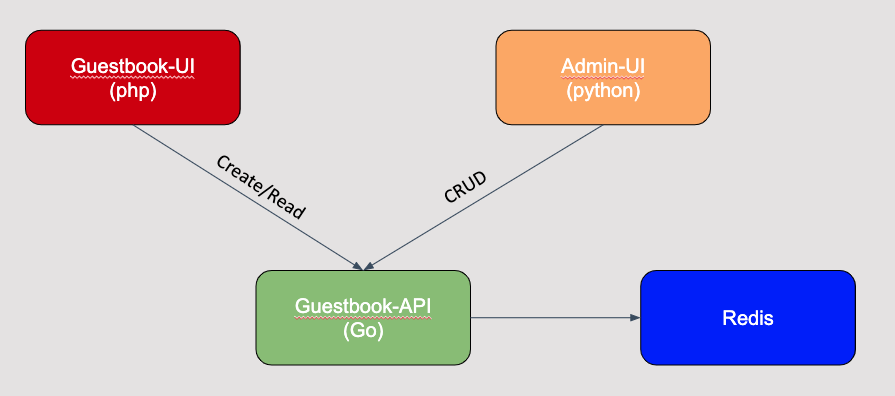
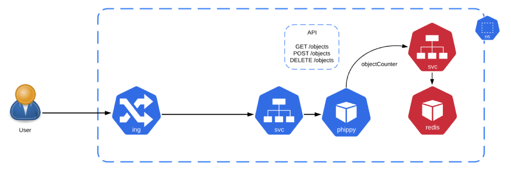
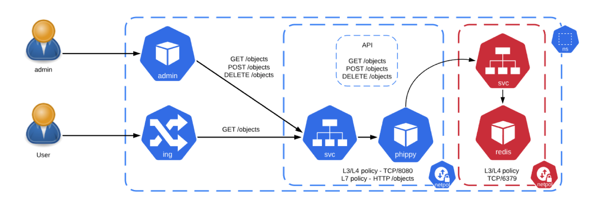

# Guestbook

- admin --> https://github.com/kubernetes/examples/blob/master/guestbook/php-redis/guestbook.php
- users --> python ui
- api --> https://github.com/IBM/guestbook/blob/master/v2/guestbook/main.go

Guesbook-UI  --> record number of visits
             --> add review/comments

Admin-UI --> manage number of visits
         --> delete messages/visits

Guestbook-API --> expose a rest api to UIs
              --> write data into Redis

Redis --> save data into redis

The phippy-api has the following endpoints:
- /visits -> increase number of visits
- /message - add a message
- /version - the guestbook-api version 
- /healthz - says if the app is healthy (ex: check the connection to Redis)
- /hostname - get the Pod hostname

## Guestbook architecture

## Guestbook deployment

## Guestbook isolation

## Demo

### Hits ###
curl -X POST $APIURL/hits | jq . 
curl -X GET $APIURL/hits | jq . 
curl -X DELETE $APIURL/hits | jq . 

### Message ####
export APIURL="http://localhost:8080"
data='{
  "Text": "Very nice experience!",
  "Name": "John Smith"
}'

# CREATE
curl -X POST $APIURL/message --data "$data" -H "Content-Type: application/json" | jq . 

# GET
## messages
curl -X GET $APIURL/messages --data "$data" -H "Content-Type: application/json" | jq . 

## message
id=""
curl -X GET $APIURL/message/$id -H "Content-Type: application/json" | jq . 

# DELETE
id=""
curl -X DELETE $APIURL/message/$id -H "Content-Type: application/json" | jq . 
